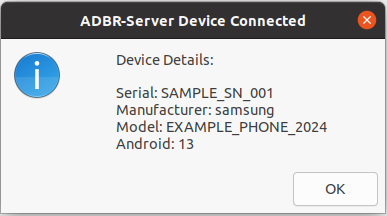

# ADBR-Server

A modern implementation of the Android Debug Bridge (ADB) server written in Rust, focusing on code maintainability, stability, and better error handling. Currently supports Linux systems and USB devices only (for now).

This server works in tandem with the [ADBR Client](https://github.com/xDvir/ADBRClient) to provide a complete ADB replacement solution. Together, they offer enhanced stability, better error handling, and unique features when used as a pair. Future releases will introduce exclusive features that leverage the client-server collaboration.

The ADBR project aims to improve the Android debugging experience. We welcome:
- Features you've always wanted in ADB
- New use cases for device management
- Any other enhancement ideas

For client installation and documentation, please visit the [ADBR Client repository](https://github.com/xDvir/ADBRClient).

## Why ADBR-Server?

- 📝 Clean, modern Rust implementation compared to AOSP's C-based ADB server
- ✨ Improved error handling and stability
- 🚀 Well-structured and maintainable codebase
- 🔍 Proven stability with multiple devices (successfully tested with 16+ concurrent device connections)
- 🔔 Innovative device actions system

Key improvements over traditional ADB server:
- Clear separation of concerns in the codebase
- Modern Rust error handling patterns
- Well-structured protocol implementation
- Comprehensive logging system
- Automated device actions system

## Requirements

- Linux-based system (currently optimized for Ubuntu 20.04 or newer)
- USB-connected Android device(s) with debugging enabled

## Installation

### Option 1: Install from DEB Package (Recommended)
```bash
# Install runtime dependencies
sudo apt-get install -y libusb-1.0-0

# Download and install
wget https://raw.githubusercontent.com/xDvir/ADBRServer/main/releases/adbr-server_1.0.0-1.deb
sudo dpkg -i adbr-server_1.0.0-1.deb

# If needed, resolve dependencies
sudo apt-get install -f
```

### Option 2: Build from Source
```bash
# Install build dependencies
sudo apt-get update
sudo apt-get install -y build-essential pkg-config libusb-1.0-0-dev

# Clone and build
git clone https://github.com/xDvir/ADBRServer.git
cd ADBRServer
./build_deb.sh
```

# Server Usage

First, install the ADBR server following the installation instructions above, then install the ADBR client from: [ADBR Client repository](https://github.com/xDvir/ADBRClient). Ensure your Android device is connected via USB with debugging enabled.

## Starting the Server

```bash
Usage: adbr-server <command> [options]

Commands:
  start-server    Start the ADBR server in background
  kill-server     Kill the running ADBR server
  restart-server  Restart the ADBR server

Options:
  -a             Listen on all network interfaces (default: localhost only)
  -p <port>      Specify port number (default: 5037)

Examples:
  adbr-server start-server
  adbr-server start-server -a -p 5038
  adbr-server kill-server
  adbr-server restart-server
```

Make sure the normal ADB server is not running (kill it if necessary):
```bash
adb kill-server
```
Then start the server:
```bash
adbr-server start-server
```

Finally, test device connection:
```bash
adbr devices
```

## ADBR-Server Actions

The ADBR-Server includes a powerful Actions system that sets it apart from standard ADB implementations. This feature enables automated responses to device events, making it perfect for development environments, testing labs, and automated workflows.

### Action Types

1. Global Actions
    - Apply to all devices
    - Useful for general logging, notifications, or system maintenance

2. Device-Specific Actions
    - Triggered only for specific device serial numbers
    - Perfect for device-specific setup or testing workflows

### Configuration

The Actions system uses a YAML configuration file located at:
`~/.config/adbr-server/actions.yml`

Example configuration:
```yaml
# Global actions for all devices
global:
  connect:
    - id: "connect-notify"
      cmd: "~/.config/adbr-server/scripts/connect.sh {serial}"
  disconnect:
    - id: "disconnect-notify"
      cmd: "~/.config/adbr-server/scripts/disconnect.sh {serial}"

# Device-specific actions
devices:
  "PIXEL6PRO123":
    connect:
      - id: "pixel-connect"
        cmd: "~/.config/adbr-server/scripts/pixel_connect.sh {serial}"
```

### Example Action Script

Here's a practical example of a device connection notification script:

```bash
# ~/.config/adbr-server/scripts/connect.sh
#!/bin/bash
SERIAL=$1
MANUFACTURER=$(adbr -s $SERIAL shell getprop ro.product.manufacturer)
MODEL=$(adbr -s $SERIAL shell getprop ro.product.model)
ANDROID=$(adbr -s $SERIAL shell getprop ro.build.version.release)

# Play sound if exists
if [ -f "/usr/share/sounds/freedesktop/stereo/device-added.oga" ]; then
    paplay /usr/share/sounds/freedesktop/stereo/device-added.oga
fi

# Visual notification using zenity
zenity --info \
  --title="ADBR Device Connected" \
  --width=300 \
  --text="Device Details:\n\nSerial: $SERIAL\nManufacturer: $MANUFACTURER\nModel: $MODEL\nAndroid: $ANDROID"
```

When a device connects, this script will display a notification like this:



*Example notification showing device details including serial number, manufacturer, model, and Android version*

### Use Cases
- Automated testing setups
- Device provisioning
- Development environment configuration
- CI/CD pipelines
- Device monitoring and logging
- Custom notification systems

## Command Reference

### Device Management
```bash
# List connected devices
adbr devices

# Continuously monitor device connections
adbr devices -w

# Wait for device to connect
adbr wait-for-device

# Get device state
adbr get-state
```

### File Operations
```bash
# Push files to device
adbr push local_file.txt /sdcard/
adbr push --sync folder/ /sdcard/folder/  # Only push newer files

# Pull files from device
adbr pull /sdcard/file.txt ./
adbr pull -a /sdcard/file.txt ./  # Preserve file timestamp and mode
```

### App Management
```bash
# Install APK
adbr install app.apk
adbr install -r app.apk          # Replace existing application
adbr install -d app.apk          # Allow version code downgrade
adbr install -g app.apk          # Grant all runtime permissions
adbr install -t app.apk          # Allow test packages
adbr install -s app.apk          # Install on SD card
adbr install -f app.apk          # Install on internal system memory
adbr install -l app.apk          # Forward lock application

# Uninstall package
adbr uninstall com.example.app
adbr uninstall -k com.example.app  # Keep data and cache directories
```

### Networking
```bash
# Port forwarding
adbr forward tcp:8000 tcp:8001
adbr forward --list              # List all forwards
adbr forward --no-rebind tcp:8000 tcp:8001  # Fail if already used
adbr forward --remove tcp:8000   # Remove specific forward
adbr forward --remove-all        # Remove all forwards

# Reverse port forwarding
adbr reverse tcp:8000 tcp:8001
adbr reverse --list              # List all reverse forwards
adbr reverse --no-rebind tcp:8000 tcp:8001  # Fail if already used
adbr reverse --remove tcp:8000   # Remove specific reverse
adbr reverse --remove-all        # Remove all reverses
```

### Shell Commands
```bash
# Interactive shell
adbr shell

# Run specific command
adbr shell "ls -l /sdcard"

# System commands
adbr root                        # Restart adbd with root permissions
adbr unroot                      # Restart adbd without root permissions
adbr remount                     # Remount partitions read-write
adbr reboot                      # Reboot device
adbr reboot bootloader           # Reboot to bootloader
adbr reboot recovery             # Reboot to recovery

# Verity commands
adbr disable-verity             # Disable dm-verity on userdebug builds
adbr enable-verity              # Re-enable dm-verity on userdebug builds
```

### Logging
```bash
# View device log
adbr logcat

# Clear log and exit
adbr logcat -c

# Write log to file
adbr logcat -f log.txt

# Filter by tag and priority
adbr logcat ActivityManager:I *:S

# Dump log and exit
adbr logcat -d

# Show last N lines
adbr logcat -t 100

# Set output format
adbr logcat -v time

# Generate bug report
adbr bugreport
adbr bugreport bugreport.zip
```

### Global Options
```bash
# Specify device serial number
adbr -s SERIAL_NUMBER <command>

# Use specific USB device
adbr -d <command>

# Specify server host and port
adbr -H host -P port <command>
```

## Notes

- Optimized for Linux systems
- Proven stability with multiple USB devices
- Works with the ADBR client or standard ADB client
- Default port: 5037
- Logs stored in: /tmp/adbr-server/

## Contributing

Found a bug or want to contribute? Open an issue or submit a pull request!

## Bug Reports

Found a bug? Help us improve by:
1. Opening a detailed issue describing:
   - What happened
   - What you expected
   - Steps to reproduce
   - Your environment (OS, device type)
2. Including relevant logs from `/tmp/adbr-server/`
3. Adding the "bug" label to your issue

Your feedback and contributions help make ADBR better for everyone! 

## License

Licensed under the Apache License, Version 2.0 (the "License");
you may not use this file except in compliance with the License.
You may obtain a copy of the License at

    http://www.apache.org/licenses/LICENSE-2.0

Unless required by applicable law or agreed to in writing, software
distributed under the License is distributed on an "AS IS" BASIS,
WITHOUT WARRANTIES OR CONDITIONS OF ANY KIND, either express or implied.
See the License for the specific language governing permissions and
limitations under the License.

## Version History

1.0.0-1: Initial release
- Complete core ADB protocol implementation
- Multi-device USB support
- Advanced device actions system
- Comprehensive logging system
- Debian package support